# NEXORA Platform — Architecture, Workflow and Vision

| Field | Value |
|---|---|
| Document | `/docs/nexora-platform-architecture.md` |
| Status | Draft — for review |
| Version | 0.1.0 |
| Date | 2026-09-22 |
| Owner | Architecture Agent |
| Supersedes | — |
| Extends | `ADR-0001 — Core Architecture Model` |
| Related | `/docs/architecture.md`, `/docs/system-overview.md`, `/docs/security.md`, `/docs/adr/*` |

> This document extends ADR-0001 from a repository-level architecture to a
> **company-level platform architecture**. The layered model, zero-trust posture,
> module-boundary discipline and ADR governance defined in ADR-0001 remain
> authoritative. Nothing here replaces them; everything here applies them to a
> multi-product, multi-subdomain platform.

---

## 0. How to read this document

| If you are… | Read |
|---|---|
| Deciding *what NEXORA is* | §1 Vision, §2 Principles |
| Deciding *what to build first* | §14 Build workflow, §15 Developer workflow |
| Building the platform core | §4 NEXORA Core, §5 Product Registry, §6 Identity |
| Building a product (Sentinel, CSPM, Gateway) | §4.3 Tenant Contract, §8.4 Product surface, §15 |
| Setting up infrastructure | §7 Domains, §10 Stack, §11 Environments & CI/CD |
| Reviewing security | §6.5, §12 Security model |
| Writing the follow-up docs | §16 ADR backlog, Appendix B |

**Scope of this document:** architecture, contracts, workflow and sequencing.
**Out of scope:** implementation code, visual design specification, copywriting,
pricing, legal terms.

---

## 1. Vision

### 1.1 Positioning statement

> **NEXORA — Build What's Next.**
> Technology · AI · Security.
> NEXORA is a technology platform. Its products are intelligent software, AI
> systems and secure digital products that share one account, one console, one
> API surface and one operational backbone.

### 1.2 What NEXORA is and is not

| NEXORA is | NEXORA is not |
|---|---|
| A platform whose products are *tenants* of shared infrastructure | A portfolio site listing unrelated projects |
| A single identity, billing and API boundary for all products | A set of independent apps with independent logins |
| A registry-driven system where adding a product is a data operation | A site redesigned by hand for every launch |
| A company with a developer surface (APIs, SDKs, docs, status) | A software agency with a contact form as its main call to action |

### 1.3 The core thesis

The strategic decision is this: **build the platform before building the next product.**

A standalone product adds one unit of value. A platform adds one unit of value
*and* reduces the cost of every future product. Once NEXORA Core exists, every
new product inherits authentication, accounts, organisations, billing, API keys,
navigation, documentation, status reporting and analytics on day one. The
marginal cost of product N+1 collapses.

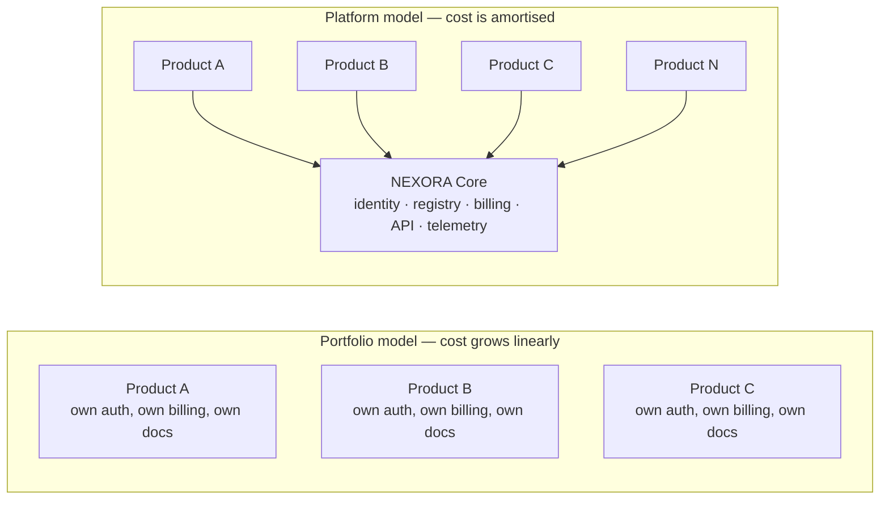

### 1.4 Success criteria

The architecture is successful when all of the following are true and verifiable:

| # | Criterion | Measurement |
|---|---|---|
| SC-1 | Launching a product requires no homepage code change | New registry record renders on `/products`, search and nav automatically |
| SC-2 | One account works everywhere | A user signs in once and reaches every product subdomain without re-authenticating |
| SC-3 | A new product reaches "platform ready" in under one working day | Time from repository creation to authenticated shell on a subdomain |
| SC-4 | Every product reports health centrally | All registry-listed products publish a health signal consumed by `status` |
| SC-5 | No product owns a user record | User and organisation identity exists in exactly one system |
| SC-6 | Documentation cannot silently drift | Docs are built from the same registry data as the site |

---

## 2. Architectural principles

Principles P-1 to P-5 are inherited from ADR-0001. P-6 to P-12 are additions
required by the multi-product model.

| ID | Principle | Consequence for developers |
|---|---|---|
| P-1 | Layered architecture | A layer may depend downward, never upward or sideways across products |
| P-2 | Clear module boundaries | Cross-module access happens through published interfaces only |
| P-3 | Predictable data flow | Input → validation → core logic → module → pipeline → output |
| P-4 | Minimal coupling, maximal cohesion | Shared code lives in a named package or it is duplicated deliberately |
| P-5 | Zero trust at every layer | Every input, including input from another NEXORA service, is untrusted |
| P-6 | **Registry as single source of truth** | If it is not in the Product Registry, it does not exist on the platform |
| P-7 | **One identity, many products** | Products consume identity; they never store credentials or issue sessions |
| P-8 | **Subdomain per product, one shell** | Each product owns a subdomain and renders the shared NEXORA shell |
| P-9 | **Contract before implementation** | A product's capability is declared in the Tenant Contract before code exists |
| P-10 | **Core is boring and stable** | Breaking changes to Core require an ADR; products may move fast |
| P-11 | **Every surface is documented and observable** | No surface ships without docs entry and health signal |
| P-12 | **Build for deletion** | Any product must be removable by retiring its registry record and subdomain |

---

## 3. System landscape

### 3.1 Context

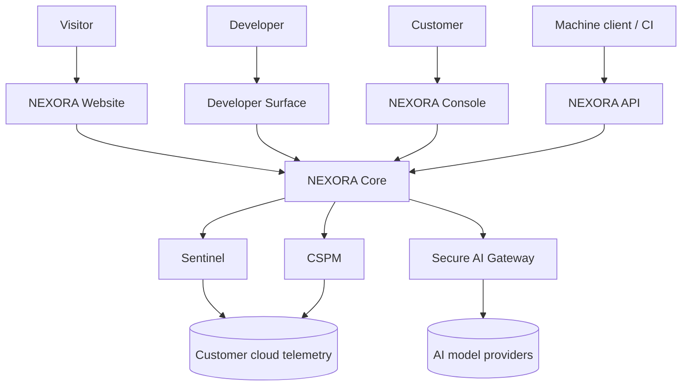

### 3.2 Containers

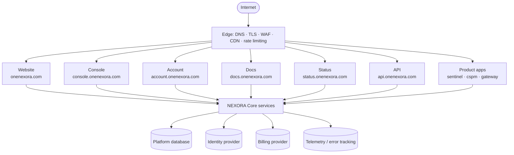

### 3.3 The layer model

ADR-0001 defines five layers. At platform scale they map as follows.

| ADR-0001 layer | Platform meaning | Contains |
|---|---|---|
| Core | **Platform Core** | Identity, Product Registry, Billing, API keys, Telemetry, Notifications, Entitlements |
| Modules | **Product Layer** | Sentinel, CSPM, Secure AI Gateway, future products |
| Pipelines | **Delivery Layer** | CI/CD, scheduled jobs, ingestion pipelines, provisioning |
| Security | **Trust Layer** | Edge protection, authorisation, validation, audit, threat detection |
| Documentation | **Knowledge Layer** | Site content, docs, ADRs, status, changelog |

Added at platform scale:

| New layer | Reason |
|---|---|
| **Edge Layer** | A multi-subdomain platform needs one place for DNS, TLS, WAF, caching and routing |
| **Experience Layer** | Website, console and product UIs share a shell, design system and navigation contract |

Dependency rule, strictly enforced:

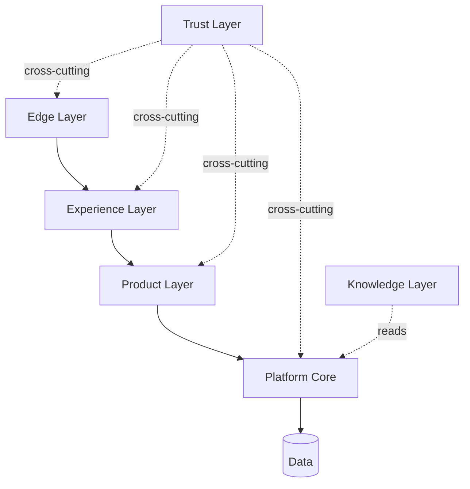

A product may call Core. **Core may never call a product.** Core learns about
products only through the registry and through health signals that products push.

---

## 4. NEXORA Core — the invisible layer

Core is the reason the platform is a platform. It is small, stable and shared.

### 4.1 Core services

| Service | Responsibility | Owns | Never does |
|---|---|---|---|
| **Identity** | Authentication, sessions, MFA, SSO across subdomains | User records, sessions | Business logic, product data |
| **Organisations** | Tenancy, membership, roles, invitations | Org records, memberships | Product-specific permissions beyond role mapping |
| **Product Registry** | Catalogue of every NEXORA product and its metadata | Product records, categories, lifecycle state | Runtime product state |
| **Entitlements** | What an org is allowed to use | Plans, limits, feature flags per org | Payment capture |
| **Billing** | Subscriptions, invoices, payment provider integration | Subscription records | Deciding feature access directly (it feeds Entitlements) |
| **API Keys** | Machine identity, scopes, rotation, revocation | Key records and hashes | Storing plaintext secrets |
| **Telemetry** | Usage counters, audit log, error aggregation | Events, audit records | Product analytics semantics |
| **Notifications** | Transactional email, in-app alerts, webhooks out | Delivery state | Marketing campaigns |
| **Health** | Collects product health signals, computes platform status | Incident and uptime records | Deciding whether a product is broken (products self-report) |

### 4.2 Contracts between Core and products

Every interaction is one of four contracts. Nothing else is permitted.

| Contract | Direction | Purpose |
|---|---|---|
| **C-AUTH** | Product → Core | Verify the caller's identity and organisation |
| **C-ENT** | Product → Core | Ask whether the organisation may perform an action or exceed a limit |
| **C-EVENT** | Product → Core | Report a usage event, audit record or health heartbeat |
| **C-META** | Core → Public surfaces | Serve registry metadata to website, console, docs, status and search |

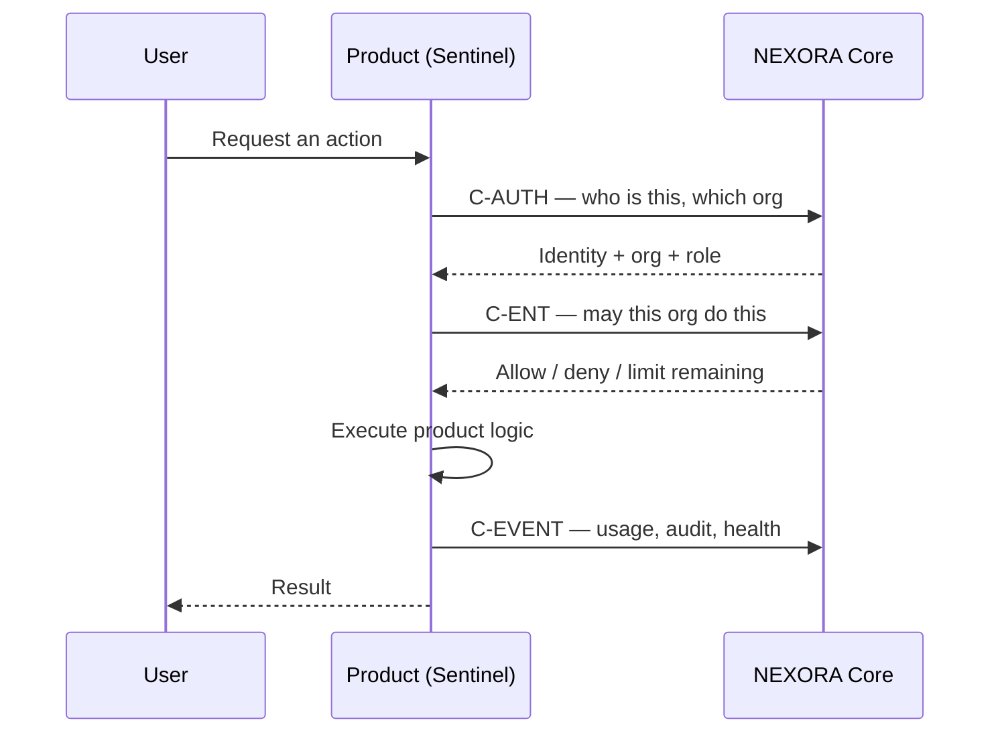

### 4.3 The Tenant Contract

A product is "platform ready" when it satisfies every row. This is the checklist
used at review. No product is added to the registry as `production` without it.

| # | Requirement | Verification |
|---|---|---|
| T-1 | Has a registry record with slug, category, lifecycle state and URLs | Record exists and renders on `/products` |
| T-2 | Authenticates only through Core identity; no local user table | Code review: no credential storage |
| T-3 | Resolves organisation context on every request | Request trace shows org id |
| T-4 | Checks entitlements before any billable or limited action | Test: denied action when limit exceeded |
| T-5 | Emits usage and audit events to Core | Events visible in console usage view |
| T-6 | Publishes a health endpoint consumed by Health service | Appears on status page |
| T-7 | Renders the shared shell: header, product switcher, account menu | Visual review against shell spec |
| T-8 | Has a documentation entry and at least a quickstart | Page exists under docs |
| T-9 | Has a public marketing surface at its subdomain root | `product.onenexora.com` resolves to an overview, not a login form |
| T-10 | Can be disabled by flipping its registry lifecycle state | Test: state change removes it from surfaces |

---

## 5. Product Registry — the keystone

### 5.1 Why registry-first

Without a registry, every launch is a website project. With a registry, a launch
is a data change that propagates automatically to the homepage, the products
page, search, navigation, the console, docs and status. The registry is the
single highest-leverage component in this architecture and should be built in
Phase 1.

### 5.2 Entity model

Described as fields, not schema code.

**Product**

| Field | Type | Notes |
|---|---|---|
| id | identifier | Stable, never reused |
| slug | short text | Lowercase, kebab-case, equals subdomain label |
| name | text | Display name, e.g. "AI Cloud Log Sentinel" |
| short_name | text | Console and nav label, e.g. "Sentinel" |
| tagline | text | One line, under 60 characters |
| description | long text | Markdown, used on product and listing pages |
| category | enum | `ai` · `security` · `cloud` · `developer` |
| platform_pillar | enum | Which platform pillar it belongs to |
| lifecycle | enum | `concept` · `alpha` · `beta` · `production` · `maintenance` · `retired` |
| visibility | enum | `public` · `private` · `internal` |
| featured | boolean | Drives homepage placement |
| url | url | Product root subdomain |
| app_url | url | Authenticated application entry |
| docs_url | url | Documentation entry |
| pricing_url | url | Optional |
| repository_url | url | Optional, for open components |
| icon | reference | Asset key in the design system |
| version | text | Current public version |
| health_source | url | Endpoint consumed by Health service |
| owner | reference | Responsible person or team |
| launched_at | date | Nullable |

**Supporting entities**

| Entity | Purpose | Key fields |
|---|---|---|
| ProductCapability | Feature bullets shown on product and listing pages | product, label, description, order |
| ProductPlan | Commercial tiers surfaced to entitlements and pricing | product, name, limits, price reference |
| ProductIntegration | Declares which other NEXORA products it connects to | product, target product, direction |
| ProductDocSection | Maps docs navigation per product | product, path, title, order |

### 5.3 Lifecycle states

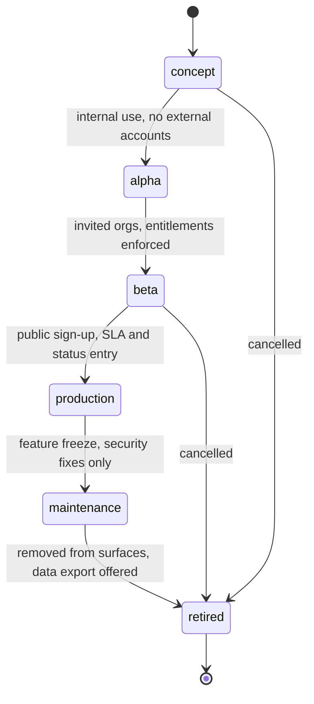

Rules:

- `concept` and `alpha` appear only in Labs and internal console views.
- `beta` appears publicly with a visible badge.
- `production` requires the full Tenant Contract (§4.3) and a status entry.
- `retired` records are never deleted; they preserve historical links.

### 5.4 Consumption flow

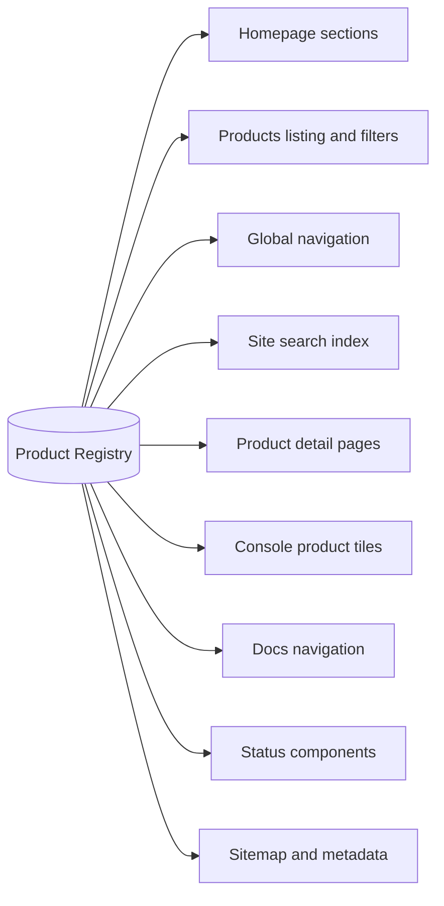

One write, nine surfaces updated. This is what SC-1 measures.

### 5.5 Governance

Adding or promoting a product is a reviewed action, not an ad-hoc edit.

| Step | Actor | Gate |
|---|---|---|
| 1. Propose record | Product owner | Slug available, category valid, no naming collision |
| 2. Reserve subdomain | Platform owner | Follows naming convention (Appendix A) |
| 3. Build to Tenant Contract | Product team | §4.3 checklist |
| 4. Architecture review | Architecture Agent | Boundaries, dependency direction, Core usage |
| 5. Security review | Pentest Agent | §12 threat checklist |
| 6. Docs review | Documentation Agent | Quickstart, reference, changelog entry |
| 7. Promote lifecycle | Platform owner | Status entry live, health signal green |

---

## 6. Identity and access

### 6.1 One NEXORA Account

A single account spans every subdomain. `account.onenexora.com` is the
self-service surface for profile, organisations, security, API keys, billing and
connected products.

### 6.2 Organisations, roles and RBAC

Tenancy is at the **organisation** level. A user may belong to several
organisations and switches context explicitly.

| Role | Platform scope | Product scope | Billing |
|---|---|---|---|
| Owner | Full, including deletion | Full | Full |
| Admin | Manage members, keys, settings | Full | View, cannot change plan |
| Member | Use products | As granted per product | None |
| Billing | None beyond billing | None | Full |
| Viewer | Read-only | Read-only | None |

Products map these platform roles to product-specific permissions. **Products do
not invent new user identities or parallel role systems.**

### 6.3 Cross-subdomain session flow

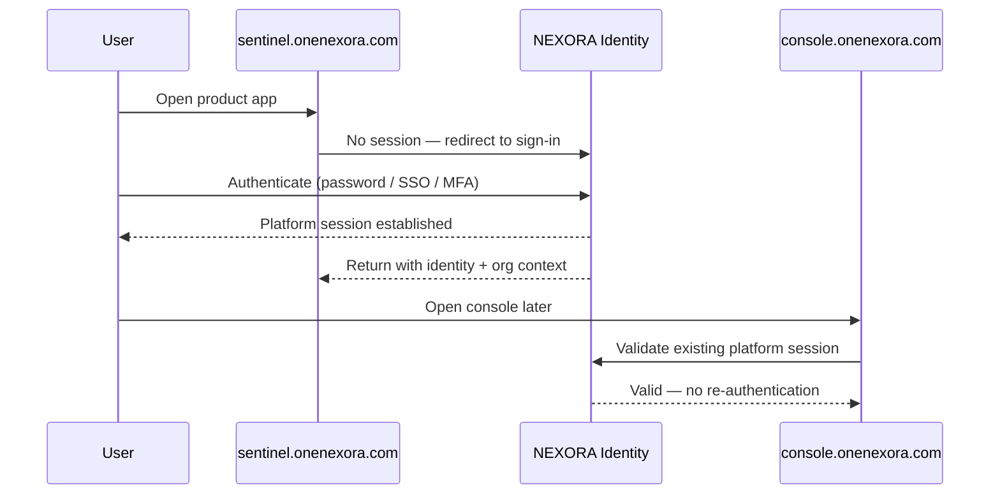

Rules:

- Sessions are issued and validated by Identity only.
- Products receive short-lived, verifiable identity assertions — never long-lived secrets.
- Organisation context is explicit in every authenticated request.
- Session revocation is global: revoking at Identity ends access everywhere.

### 6.4 Machine identity

| Property | Rule |
|---|---|
| Ownership | Keys belong to an organisation, not a person |
| Scope | Least privilege — product, action and environment scoped |
| Storage | Hashed; plaintext shown exactly once at creation |
| Rotation | Supported without downtime; overlapping validity window |
| Revocation | Immediate and global |
| Audit | Every key use produces a telemetry event with key id, never key value |

### 6.5 Zero-trust rules for identity

- Treat every request as untrusted, including service-to-service traffic.
- Authorise per request; never cache an allow decision beyond its stated lifetime.
- Never derive permission from the subdomain, referrer or client-supplied role.
- Never log tokens, keys, cookies or personal data (see §12.4).

---

## 7. Domain and routing architecture

### 7.1 Domain map

Reserve and configure all of these now, even if most return a placeholder. The
naming convention is the asset; deployment can follow later.

| Host | Purpose | Layer | Phase |
|---|---|---|---|
| `onenexora.com` | Company and platform website | Experience | 1 |
| `www.onenexora.com` | Canonical redirect | Edge | 1 |
| `ai.onenexora.com` | AI pillar overview | Experience | 3 |
| `security.onenexora.com` | Security pillar overview | Experience | 3 |
| `cloud.onenexora.com` | Cloud pillar overview | Experience | 3 |
| `console.onenexora.com` | Authenticated control plane | Experience | 2 |
| `account.onenexora.com` | Account and organisation management | Experience | 2 |
| `api.onenexora.com` | Public API entry point | Core | 3 |
| `docs.onenexora.com` | Documentation | Knowledge | 3 |
| `developers.onenexora.com` | Developer landing surface | Experience | 3 |
| `status.onenexora.com` | Platform status | Knowledge | 2 |
| `sentinel.onenexora.com` | Product: Sentinel | Product | 4 |
| `cspm.onenexora.com` | Product: CSPM | Product | 4 |
| `gateway.onenexora.com` | Product: Secure AI Gateway | Product | 5 |
| `labs.onenexora.com` | Experiments and research | Product | 5 |
| `research.onenexora.com` | Long-form research output | Knowledge | 6 |

### 7.2 Routing rules

| Rule | Statement |
|---|---|
| R-1 | One product, one subdomain. Products never live on a path of the main site |
| R-2 | A product subdomain root is a **public overview**, not a login screen |
| R-3 | Authenticated product UI lives under `/app` on the product subdomain |
| R-4 | Product docs live under `/docs` on the product subdomain **and** are aggregated into `docs.onenexora.com` |
| R-5 | Platform-level pages (`/platform`, `/products`, `/solutions`, `/company`, `/labs`) live on the apex domain |
| R-6 | Reserved labels are never assigned to products: `www`, `api`, `app`, `docs`, `status`, `console`, `account`, `auth`, `id`, `cdn`, `assets`, `mail`, `admin`, `internal`, `staging` |
| R-7 | Every subdomain enforces TLS, HSTS and the platform security header set |
| R-8 | Retired products keep their subdomain resolving to a redirect or notice, never to a dead host |

### 7.3 Edge responsibilities

| Concern | Handled at edge | Not handled at edge |
|---|---|---|
| DNS, TLS, certificate lifecycle | Yes | — |
| WAF, bot mitigation, DDoS absorption | Yes | — |
| Static caching and CDN | Yes | — |
| Coarse rate limiting per IP and per host | Yes | Per-organisation quotas (Entitlements) |
| Security headers | Yes | — |
| Authentication | No | Identity service |
| Authorisation | No | Product + Entitlements |

---

## 8. Web surfaces

### 8.1 Marketing site information architecture

```
onenexora.com
├── /                       Homepage — platform, products, labs, contact
├── /platform               The NEXORA Platform
│   ├── /ai                 Intelligence, APIs, agents, LLM applications
│   ├── /security           Cloud security, AI security, CSPM, threat detection
│   └── /cloud              Infrastructure, DevOps, MLOps
├── /products               Registry-driven catalogue
│   └── /[slug]             Product detail page (registry-driven)
├── /solutions              Outcome-oriented pages
│   ├── /ai-development
│   ├── /cloud-security
│   ├── /ai-security
│   └── /automation
├── /developers             APIs, SDKs, CLI, webhooks
├── /labs                   Experiments, research, open source
│   └── /[slug]             Experiment detail
├── /company                About, positioning, contact, careers
├── /changelog              Platform-wide release notes
├── /legal                  Terms, privacy, security statement
└── /status                 Redirect to status.onenexora.com
```

### 8.2 Navigation contract

Global navigation is generated from the registry plus a small static map, so it
cannot drift from reality.

| Nav item | Source | Behaviour |
|---|---|---|
| Platform | Static map of three pillars | Dropdown: AI, Security, Cloud |
| Products | Registry, `visibility = public` | Dropdown: featured products + "All products" |
| Solutions | Static map | Dropdown of solution pages |
| Developers | Static | Links to developers surface and docs |
| Labs | Registry, `lifecycle in (concept, alpha)` plus labs entries | Direct link |
| Company | Static | Direct link |
| Console | Identity state | "Console" when signed in, "Sign in" when not |

### 8.3 Page contract

Every template declares its data source before it is built.

| Route | Purpose | Primary data | Primary action |
|---|---|---|---|
| `/` | Communicate the platform in one screen, then the ecosystem | Registry (featured), static hero | Explore Platform |
| `/platform/[pillar]` | Explain a pillar and list its products | Registry filtered by pillar | Explore products |
| `/products` | Filterable catalogue | Registry, all public | Open product |
| `/products/[slug]` | Product overview, capabilities, plans, docs links | Registry + capabilities + plans | Get started |
| `/solutions/[slug]` | Map a customer problem to products | Static + registry references | Start a project |
| `/developers` | Entry point for building on NEXORA | Static + docs index | Read docs |
| `/labs` | Signal research depth | Registry, non-production lifecycle | Explore experiment |
| `/company` | Credibility and contact | Static | Contact |

### 8.4 Product surface template

Every product subdomain follows the same three-zone structure. This is what
makes separate products feel like one company.

| Zone | Content | Notes |
|---|---|---|
| Shell | NEXORA wordmark, product switcher, account menu, environment badge | Shared component; identical everywhere |
| Public zone (`/`) | Product name, tagline, capability summary, flow diagram, pricing link, docs link, primary CTA | Registry-driven where possible |
| Authenticated zone (`/app`) | Product application | Product-owned; must resolve org context |
| Knowledge zone (`/docs`) | Quickstart, concepts, reference, changelog | Mirrored into the central docs site |

Required public-zone elements, in order: identity block, one-sentence value
statement, three-verb summary, primary and secondary CTA, architecture or flow
diagram, capability list, lifecycle badge, link to status.

### 8.5 Console information architecture

The console is the authenticated control plane — the single place where a
customer sees everything they have with NEXORA.

| Section | Content | Backed by |
|---|---|---|
| Overview | Org summary, active products, recent activity, health | Registry + Telemetry + Health |
| Products | Tiles for every entitled product, with state and deep link | Registry + Entitlements |
| Usage | Requests, ingestion volume, quota consumption over time | Telemetry |
| Security | Sign-in activity, MFA state, audit log, sessions | Identity + Telemetry |
| Organisation | Members, roles, invitations | Organisations |
| API Keys | Create, scope, rotate, revoke | API Keys |
| Billing | Plan, invoices, payment method, upgrade path | Billing + Entitlements |
| Settings | Org profile, notification preferences, data region | Organisations |

Console rule: **the console never hardcodes a product.** Tiles are rendered from
registry records intersected with entitlements.

### 8.6 Developer surface

| Component | Purpose |
|---|---|
| `developers.onenexora.com` | Narrative entry point: what you can build, where to start |
| `docs.onenexora.com` | Structured documentation: platform concepts, per-product docs, API reference |
| `api.onenexora.com` | The API itself, versioned, with a published error contract |
| SDK and CLI references | Installation, authentication, first request, common recipes |

Documentation structure, applied identically to every product:
**Quickstart → Concepts → Guides → Reference → Limits → Changelog.**

### 8.7 Labs

Labs is deliberately visually distinct and deliberately low-commitment. It
carries `concept` and `alpha` lifecycle records, research write-ups and open
source components. Labs entries must state clearly that they carry no SLA. Labs
is where a future product proves itself before it earns a registry promotion.

### 8.8 Status

Status consumes health signals from every `beta` and `production` registry
record and renders component state, incident history and uptime. Status is not
decorative: it is the external proof that the platform is operated, not merely
deployed.

---

## 9. Repository and code topology

### 9.1 Repositories

Avoid both extremes: a single company-wide monorepo, and a repository per page.

| Repository | Contains | Rationale |
|---|---|---|
| `nexora-platform` | Website, console, account, docs, shared packages, infrastructure | These share the design system, registry client and identity client; they must version together |
| `nexora-sentinel` | Sentinel product | Independent release cadence and domain logic |
| `nexora-cspm` | CSPM product | Independent release cadence |
| `nexora-gateway` | Secure AI Gateway | Independent release cadence, different runtime profile |
| `nexora-core-api` | Public API service and Core service implementations | Stability boundary; changes are ADR-governed |
| `COPILOT-PROMPTS` | Agents, prompts, standards, ADR governance | Already exists; remains the standards source |

### 9.2 Monorepo layout

```
nexora-platform/
├── apps/
│   ├── website/            onenexora.com
│   ├── console/            console.onenexora.com
│   ├── account/            account.onenexora.com
│   ├── docs/               docs.onenexora.com
│   └── status/             status.onenexora.com
├── packages/
│   ├── ui/                 design system components
│   ├── shell/              header, product switcher, account menu
│   ├── auth/               identity client, session helpers, guards
│   ├── registry/           registry client, types, query helpers
│   ├── entitlements/       entitlement checks
│   ├── telemetry/          event emission helpers
│   ├── database/           schema definitions and access layer
│   └── config/             shared lint, type, build and env configuration
├── infrastructure/
│   ├── docker/
│   ├── edge/               DNS, WAF, caching, header policy
│   └── deployment/
├── docs/
│   ├── architecture.md
│   ├── system-overview.md
│   ├── security.md
│   └── adr/
└── README.md
```

### 9.3 Package dependency rules

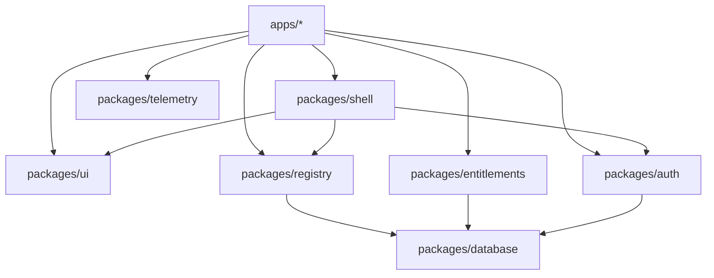

Enforced rules:

- `packages/*` must never import from `apps/*`.
- `packages/ui` has no knowledge of identity, registry or data access.
- Only `packages/database` talks to the database directly.
- A product repository consumes `ui`, `shell`, `auth`, `registry`,
  `entitlements` and `telemetry` as published versioned packages — never by path.

### 9.4 Versioning and release

| Artefact | Scheme | Breaking change policy |
|---|---|---|
| Shared packages | Semantic versioning | Major bump requires migration note |
| Public API | URI version (`/v1`) | Old version supported for a stated deprecation window |
| Products | Independent product versions shown in registry | Announced in product changelog |
| Core contracts (C-AUTH, C-ENT, C-EVENT, C-META) | Versioned, ADR-governed | Never broken silently; additive by default |

---

## 10. Technology stack

| Layer | Technology | Rationale | Replaceable by |
|---|---|---|---|
| Web framework | Next.js | Server rendering for marketing, app rendering for console, one mental model | Remix, SvelteKit |
| Language | TypeScript | Shared types between registry, clients and UI | — |
| Styling | Tailwind CSS | Deterministic, fast, avoids bespoke CSS drift | — |
| Components | shadcn/ui as the base of `packages/ui` | Owned code, not a locked dependency | Headless UI + custom |
| Motion | Framer Motion | Restrained product-grade motion | CSS transitions |
| Identity | Clerk | Existing familiarity; multi-domain sessions and orgs out of the box | Auth.js, WorkOS, Keycloak |
| Database | PostgreSQL (Supabase or managed) | Relational fit for registry, orgs, entitlements | Any managed Postgres |
| Edge | Cloudflare (DNS, TLS, WAF, CDN) | One control point for every subdomain | — |
| Runtime packaging | Docker | Portable across VPS and managed hosts | — |
| Hosting | Oracle Cloud VPS for services; managed edge for static | Cost control with owned infrastructure | Any container host |
| Payments | Stripe | Chosen over the Paddle default (see [ADR-0011](adr/ADR-0011-billing-provider-selection.md)) — direct control over checkout and billing logic, at the cost of owning tax/VAT compliance separately | Paddle (merchant of record) |
| Transactional email | Postmark | Deliverability for account and security email | Resend, SES |
| AI providers | Anthropic / OpenAI and others behind an abstraction | Provider choice must remain swappable | — |
| Error and performance monitoring | Sentry + external uptime checks | Feeds Health and status | — |
| Documentation | MDX-based docs application | Docs live with code and consume registry data | Dedicated docs platform |
| CI/CD | GitHub Actions | Already the source of truth for code and standards | — |

Stack rules:

- Every external provider sits behind an internal interface so it can be replaced.
- No provider becomes a hidden source of truth for identity, entitlements or product metadata; those live in the platform database.
- New dependencies require justification, per `copilot-instructions.md` §2.1.

---

## 11. Environments, CI/CD and operations

### 11.1 Environments

| Environment | Domain pattern | Data | Purpose |
|---|---|---|---|
| Local | `localhost` | Seeded, synthetic | Development |
| Preview | Per-branch ephemeral host | Synthetic | Review before merge |
| Staging | `staging.onenexora.com` and `*.staging.onenexora.com` | Synthetic, production-shaped | Integration and release rehearsal |
| Production | `onenexora.com` and `*.onenexora.com` | Real | Live |

Staging is not optional: a platform with cross-subdomain sessions cannot be
validated on localhost alone.

### 11.2 Pipeline stages

```mermaid
flowchart LR
    A[Commit] --> B[Lint and type check]
    B --> C[Unit tests]
    C --> D[Build all apps and packages]
    D --> E[Security checks: dependencies, secrets, headers]
    E --> F[Integration tests against preview]
    F --> G[Docs and registry consistency check]
    G --> H[Deploy to staging]
    H --> I[Smoke tests: auth, console, product tile, status]
    I --> J[Manual promotion]
    J --> K[Deploy to production]
    K --> L[Post-deploy health verification]
```

### 11.3 Promotion and rollback

| Rule | Statement |
|---|---|
| CI-1 | Pipelines are deterministic; no step depends on developer machine state |
| CI-2 | A failing security or docs-consistency check blocks merge |
| CI-3 | Production deploys are promotions of an artefact already validated in staging |
| CI-4 | Every deploy is reversible to the previous artefact within one pipeline run |
| CI-5 | Database changes are forward-compatible: deploy schema, then code, never the reverse |
| CI-6 | Post-deploy health failure triggers automatic rollback and a status incident |

### 11.4 Observability

| Signal | Source | Consumer |
|---|---|---|
| Errors | Application error tracking | Engineering, incident process |
| Uptime | External probes per subdomain | Status page |
| Product health | Product-published health endpoint | Health service, status page |
| Usage | Telemetry events | Console usage view, entitlement enforcement |
| Audit | Security-relevant events | Console security view, investigations |

---

## 12. Security model

Applies `pentest.agent.md` and ADR-0001 §Security Layer to the platform.

### 12.1 Trust boundaries

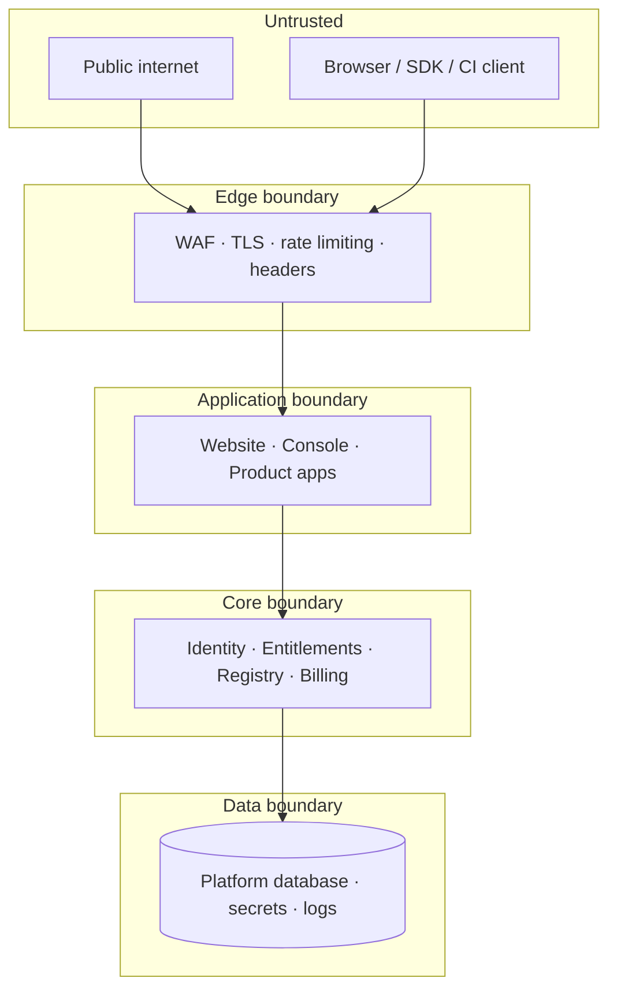

Every arrow crosses a boundary and therefore revalidates. There is no
"internal therefore trusted" zone.

### 12.2 Threat checklist per boundary

| Boundary | Primary threats | Required controls |
|---|---|---|
| Edge | DDoS, credential stuffing, scraping, bot sign-ups | WAF rules, rate limits, bot mitigation, sign-up friction |
| Application | XSS, CSRF, injection, insecure direct object reference | Output encoding, CSRF protection, strict input validation, org-scoped queries |
| Core | Privilege escalation, tenant leakage, token replay | Per-request authorisation, org scoping at query level, short-lived assertions |
| Data | Exfiltration, over-broad access, secret exposure | Least-privilege credentials, encryption at rest and in transit, secret manager |
| Supply chain | Malicious or vulnerable dependency | Lockfiles, dependency scanning, review requirement for new dependencies |
| Product-to-Core | Spoofed service calls, event forgery | Authenticated service identity, signed events, replay protection |

### 12.3 Tenant isolation

The single most consequential security rule in a multi-tenant platform:

> **Every query that reads or writes customer data is scoped by organisation at
> the data access layer, not at the UI layer.**

Isolation is verified by a test suite that attempts cross-organisation access on
every product and expects denial. This suite runs in CI.

### 12.4 Logging rules

| Never logged | Always logged |
|---|---|
| Passwords, tokens, session cookies, API key values | Actor id, org id, action, resource id, outcome, timestamp |
| Full personal data payloads | Correlation id for tracing |
| Raw customer telemetry containing secrets | Key id (not value) for machine calls |

### 12.5 Security review triggers

A Pentest Agent review is mandatory when: a new product enters `beta`, an
authentication or authorisation path changes, a new external integration is
added, a new data store is introduced, or the API adds a new version.

---

## 13. Data architecture

### 13.1 Ownership

| Data | Owner | Accessed by others via |
|---|---|---|
| Users, sessions | Identity | C-AUTH |
| Organisations, memberships, roles | Organisations | C-AUTH |
| Product metadata | Registry | C-META |
| Plans, limits, feature flags | Entitlements | C-ENT |
| Subscriptions, invoices | Billing | Console only |
| Usage, audit, health events | Telemetry / Health | C-EVENT (write), console (read) |
| Product domain data | The product | Never shared directly; exposed through the product's own API |

### 13.2 Tenancy model

Single database, shared schema, organisation-scoped rows, enforced at the access
layer. This is the right trade-off at current scale. Migration to per-tenant
schemas is possible later and should be an ADR when volume or a compliance
requirement demands it.

### 13.3 Namespacing

| Namespace | Contents |
|---|---|
| `core` | users, organisations, memberships, sessions metadata |
| `registry` | products, capabilities, plans, integrations, doc sections |
| `billing` | subscriptions, invoices, payment references |
| `telemetry` | usage events, audit records, health checks |
| `product_<slug>` | product-owned tables |

A product may read and write only its own namespace plus Core contracts.

### 13.4 Retention

| Data class | Retention | Notes |
|---|---|---|
| Audit records | Long — 12 months minimum | Security investigations |
| Usage counters | Aggregated indefinitely, raw events shorter | Billing accuracy |
| Health checks | 90 days raw, aggregated uptime indefinitely | Status history |
| Customer product data | Per product policy, stated in docs | Export on retirement |

---

## 14. Build workflow — phased delivery plan

The sequencing principle: **Core, Website, Console and Registry before the next
product.** Sentinel, CSPM and Gateway then arrive as tenants rather than as
islands.

### 14.1 Phases

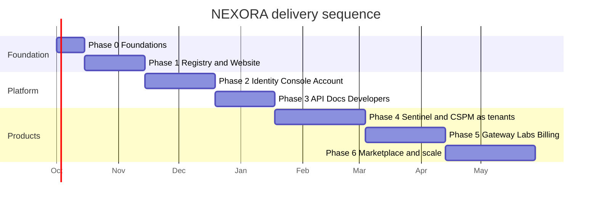

---

#### Phase 0 — Foundations

| Aspect | Detail |
|---|---|
| Goal | Make the platform buildable: names, domains, repository, standards, pipeline skeleton |
| Deliverables | Domain reservations and DNS; edge account configured; `nexora-platform` repository with monorepo layout; design tokens and base `ui` package; CI skeleton with lint, type check and build; `/docs` structure and ADR folder |
| Exit criteria | A blank page deploys to staging and production through CI on a NEXORA domain with TLS and security headers |
| Risk if skipped | Naming and routing decisions get made accidentally and become expensive to reverse |

#### Phase 1 — Product Registry and Website

| Aspect | Detail |
|---|---|
| Goal | Prove SC-1: adding a product is a data operation |
| Deliverables | Registry data model and access layer; registry client package; homepage; `/platform` and its three pillar pages; `/products` listing with category filters; `/products/[slug]` detail template; `/solutions`, `/company`, `/labs` shells; registry-driven navigation, sitemap and search index |
| Exit criteria | Creating one registry record makes a product appear on homepage, listing, detail page, nav and sitemap with no code change |
| Verification | Add a throwaway record, screenshot all five surfaces, remove it |

#### Phase 2 — Identity, Account and Console

| Aspect | Detail |
|---|---|
| Goal | One account, one control plane |
| Deliverables | Identity integration with organisations and roles; cross-subdomain session validation; `account` app (profile, orgs, security, sessions); `console` app (overview, products, organisation, API keys, settings); API key issuance, scoping, rotation and revocation; audit event emission; `status` app with manual component definitions |
| Exit criteria | A user signs up, creates an organisation, invites a member, issues an API key, and sees an empty-but-correct console; sign-in on one subdomain is recognised on another |
| Verification | Cross-subdomain session test, RBAC matrix test, key revocation test |

#### Phase 3 — API, Docs and Developer surface

| Aspect | Detail |
|---|---|
| Goal | Make NEXORA buildable-on |
| Deliverables | `api.onenexora.com` with versioning, authentication by API key, a published error contract and rate limiting; `docs` app consuming registry data; documentation structure template; `developers` landing surface; SDK and CLI plan (specification, not necessarily implementation) |
| Exit criteria | An external developer can authenticate, make a first successful call, and find the reference for it without assistance |
| Verification | A person outside the project completes the quickstart unaided |

#### Phase 4 — Sentinel and CSPM as platform tenants

| Aspect | Detail |
|---|---|
| Goal | Convert existing projects into tenants, validating the Tenant Contract |
| Deliverables | Per product: subdomain, public overview zone, `/app` authenticated zone using Core identity and org context, entitlement checks, usage and audit events, health endpoint, docs entry, registry record at `beta` |
| Exit criteria | Both products satisfy every row of §4.3; both appear in console tiles and on the status page; neither holds a user table |
| Verification | Tenant Contract checklist review plus cross-organisation isolation test |

#### Phase 5 — Gateway, Billing and Labs

| Aspect | Detail |
|---|---|
| Goal | Commercial readiness and research surface |
| Deliverables | Secure AI Gateway as a tenant; plans and entitlements wired to billing provider; subscription lifecycle in console; usage-based limits enforced; Labs surface with experiment records; open-source component publishing process |
| Exit criteria | An organisation can subscribe, be limited by plan, and see accurate usage; a Labs experiment can be published without touching the products catalogue |
| Verification | Billing lifecycle test including upgrade, downgrade and failed payment |

#### Phase 6 — Marketplace and scale

| Aspect | Detail |
|---|---|
| Goal | Turn the catalogue into an ecosystem |
| Deliverables | Marketplace taxonomy (apps, APIs, agents, models, integrations, tools); integration declarations between products; per-product analytics in console; multi-region or data-residency options if demanded; partner or third-party listing model if pursued |
| Exit criteria | A listing type other than "product" can be added without a schema rewrite |

### 14.2 Definition of done — applies to every phase

| # | Requirement |
|---|---|
| D-1 | Feature deployed to staging and production through the standard pipeline |
| D-2 | Tests added and passing: unit for logic, integration for flows, isolation for tenancy |
| D-3 | `/docs` updated; an ADR written if an architectural decision was made |
| D-4 | Security review passed for anything touching auth, data or external integration |
| D-5 | Observability in place: errors tracked, key events emitted, health reported |
| D-6 | No new cross-layer dependency introduced against §3.3 |

### 14.3 First 30 days, concretely

| Day | Action |
|---|---|
| 1–2 | Reserve all domains in §7.1; configure edge, TLS, security headers |
| 3–5 | Create `nexora-platform` with layout from §9.2; CI lint, type check, build |
| 6–10 | Design tokens and `packages/ui` primitives; shell component skeleton |
| 11–16 | Registry data model, access layer and client package |
| 17–24 | Homepage and `/products` listing rendered from the registry |
| 25–28 | Product detail template, navigation generation, sitemap and search index |
| 29–30 | Seed registry with Sentinel, CSPM and Gateway at correct lifecycle states; verify SC-1 |

---

## 15. Developer workflow

### 15.1 Adding a new NEXORA product

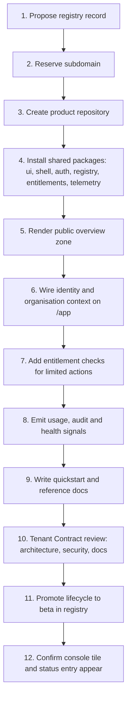

Steps 1 to 5 should take hours, not weeks, once Phases 0 to 3 are complete. That
is the measurable payoff of the platform investment (SC-3).

### 15.2 Daily working rules

Derived from `copilot-instructions.md` and `architecture.agent.md`:

- Analyse before editing; produce a multi-file plan for any change touching more than one app or package.
- State reasoning before executing an architectural change.
- Respect existing naming conventions and module boundaries.
- Update `/docs` in the same change that alters behaviour.
- Write an ADR for any decision that constrains future work.
- Do not add a dependency without a written justification.

### 15.3 Review checklist

| Area | Question |
|---|---|
| Layering | Does any code depend upward or sideways across products? |
| Core usage | Is identity, entitlement or metadata duplicated locally instead of read from Core? |
| Tenancy | Is every customer-data query organisation-scoped at the data layer? |
| Contracts | Does this change any of C-AUTH, C-ENT, C-EVENT, C-META? If so, where is the ADR? |
| Surfaces | Are docs, status and registry updated? |
| Security | Any new input, integration, secret or external call? Has the Pentest Agent reviewed it? |

---

## 16. ADR backlog

ADR-0001 stands. These are the decisions this architecture implies and which
must be recorded before or during the phase that depends on them.

| ADR | Decision | Phase | Status |
|---|---|---|---|
| ADR-0002 | Platform layering: Edge and Experience layers added to the ADR-0001 model | 0 | Proposed |
| ADR-0003 | Subdomain-per-product routing and reserved label policy | 0 | Proposed |
| ADR-0004 | Repository topology: platform monorepo plus per-product repositories | 0 | Proposed |
| ADR-0005 | Product Registry as single source of truth for product metadata | 1 | Proposed |
| ADR-0006 | Identity provider selection and cross-subdomain session strategy | 2 | Proposed |
| ADR-0007 | Tenancy model: shared schema with organisation-scoped access | 2 | Proposed |
| ADR-0008 | RBAC model and platform-to-product role mapping | 2 | Proposed |
| ADR-0009 | API versioning, error contract and deprecation policy | 3 | Proposed |
| ADR-0010 | Core contract versioning (C-AUTH, C-ENT, C-EVENT, C-META) | 3 | Proposed |
| ADR-0011 | Billing provider selection and entitlement derivation | 5 | Proposed |
| ADR-0012 | Observability and incident process, including status automation | 5 | Proposed |

---

## 17. Risks and mitigations

| # | Risk | Likelihood | Impact | Mitigation |
|---|---|---|---|---|
| R-1 | Platform work delays visible product progress | High | Medium | Phase 1 delivers a real public website; the platform is visible from month one |
| R-2 | Core becomes a bottleneck every product waits on | Medium | High | Keep Core minimal and contract-driven; products own their domain logic entirely |
| R-3 | Registry model proves too rigid for a future listing type | Medium | Medium | Model capabilities and plans as separate entities from the start; Phase 6 exit criterion tests extensibility |
| R-4 | Identity provider lock-in | Medium | High | Access identity only through `packages/auth`; never leak provider types into product code |
| R-5 | Tenant data leakage between organisations | Low | Critical | Data-layer scoping plus an automated cross-organisation isolation suite in CI |
| R-6 | Surface sprawl: subdomains that exist but are unmaintained | High | Medium | Registry lifecycle governs visibility; retired hosts redirect, never dangle |
| R-7 | Documentation drift | High | Medium | Docs consume registry data; docs-consistency check blocks merge |
| R-8 | Single-maintainer capacity | High | High | Sequence strictly by phase; refuse parallel product work before Phase 3 completes |
| R-9 | Status page promises reliability the operation cannot meet | Medium | High | Publish status only for `beta` and `production`; state SLA explicitly or state that none exists |

---

## 18. Glossary

| Term | Meaning |
|---|---|
| **NEXORA Core** | The shared services layer: identity, registry, entitlements, billing, telemetry, health |
| **Product Registry** | The catalogue that is the single source of truth for what products exist |
| **Tenant** | A product that consumes Core rather than reimplementing it |
| **Tenant Contract** | The ten requirements a product must satisfy to be platform ready (§4.3) |
| **Shell** | The shared header, product switcher and account menu rendered on every surface |
| **Pillar** | One of AI, Security, Cloud — the top-level grouping of the platform |
| **Lifecycle** | A product's registry state, from `concept` to `retired` |
| **Surface** | Any externally reachable NEXORA host or section |
| **C-AUTH / C-ENT / C-EVENT / C-META** | The four permitted Core contracts |

---

## Appendix A — Naming conventions

Extends `copilot-instructions.md` §3.2.

| Element | Convention | Example |
|---|---|---|
| Folders and files | kebab-case | `product-registry.ts` |
| Classes | PascalCase | `ProductRegistryClient` |
| Functions | camelCase | `resolveOrganisation` |
| Python | snake_case | `parse_health_signal` |
| PowerShell | Verb-Noun | `Get-ProductHealth` |
| Product slug | lowercase, single word where possible, equals subdomain label | `sentinel` |
| Subdomain | `<slug>.onenexora.com` | `cspm.onenexora.com` |
| Package name | `@nexora/<name>` | `@nexora/registry` |
| Repository | `nexora-<name>` | `nexora-gateway` |
| Environment variable | SCREAMING_SNAKE_CASE, prefixed by concern | `NEXORA_IDENTITY_ISSUER` |
| Telemetry event | `<domain>.<object>.<action>` | `sentinel.scan.completed` |
| ADR file | `ADR-NNNN-kebab-title.md` | `ADR-0005-product-registry.md` |
| Branch | `type/short-description` | `feat/registry-client` |

## Appendix B — Documents to create

| Document | Purpose | Phase |
|---|---|---|
| `/docs/architecture.md` (update) | Point to this document as the platform-level architecture | 0 |
| `/docs/system-overview.md` (update) | Describe the surface map and layer model in brief | 0 |
| `/docs/security.md` | Expand §12 into the standalone security document required by `pentest.agent.md` | 0 |
| `/docs/product-registry.md` | Entity model, lifecycle rules, governance process | 1 |
| `/docs/tenant-contract.md` | The §4.3 checklist as a standalone review artefact | 2 |
| `/docs/identity-and-access.md` | Session model, RBAC matrix, machine identity | 2 |
| `/docs/api-guidelines.md` | Versioning, errors, pagination, rate limits, deprecation | 3 |
| `/docs/operations.md` | Environments, deploy, rollback, incident process | 3 |
| `/docs/adr/ADR-0002 … ADR-0012` | Decisions listed in §16 | Per phase |

---

## Final note

The architecture above has one organising idea, and every section is a
consequence of it: **products are tenants of a platform, and the platform is
described by a registry.** Build Core, the Website, the Console and the Registry
first. After that, Sentinel, CSPM, the Secure AI Gateway and everything that
follows inherit the ecosystem instead of recreating it — which is the difference
between a portfolio of projects and a technology company.
